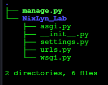

# Basics of Django #

## Getting Started ##

## Setup virtual environment ##

```!/bin/bash
virtualenv d_env
```

## Activate The Env ##

```!/bin/bash
source d_env/bin/activate
```

## Install needed packages ##

```!/bin/bash
pip install django
python -m pip install django-htmx django-htmx-refresh
pip install django_quill

```

## Check the django version ##

```!/bin/bash
python -m django --version
```

## Create Project ##

```!/bin/bash
django-admin startproject mysite
```

## Project Structure Basic ##



```!/bin/bash
mysite/
    manage.py           [A]
    mysite/             [B]
        __init__.py     [B.1]
        settings.py     [B.2]
        urls.py         [B.3]
        asgi.py         [B.4]
        wsgi.py         [B.5]

```


## These Files Are ##

-[A] manage.py: A command-line utility that lets you interact with this Django project in various ways.
    ~You can read all the details about manage.py in django-admin and manage.py.
    <a href="https://docs.djangoproject.com/en/4.2/ref/django-admin">Django Admin "manage.py"</a>

-[B] The outer mysite/ root directory is a container for your project.
    ~Its name doesn’t matter to Django; you can rename it to anything you like.

-[B./] The inner mysite/ directory is the actual Python package for your project.
    ~Its name is the Python package name you’ll need to use to import anything inside it (e.g. mysite.urls).

-[B.1] mysite/__init__.py: An empty file that tells Python that this directory should be considered a Python package. <a href="https://docs.python.org/3/tutorial/modules.html#tut-packages">Python Packages</a>

-[B.2] mysite/settings.py: Settings/configuration for this Django project.
    ~Django settings will tell you all about how settings work. <a href="https://docs.djangoproject.com/en/4.2/topics/settings">Site Settings</a>

-[B.3] mysite/urls.py: The URL declarations for this Django project; a “table of contents” of your Django-powered site.
    ~You can read more about URLs in URL dispatcher. <a href="https://docs.djangoproject.com/en/4.2/topics/http/urls"> URLS </a>
    ~Example of

### SideNotes ###

~NixLyn.github.io
    -> is not able to able to run anything other that UI:[html,css,js]
