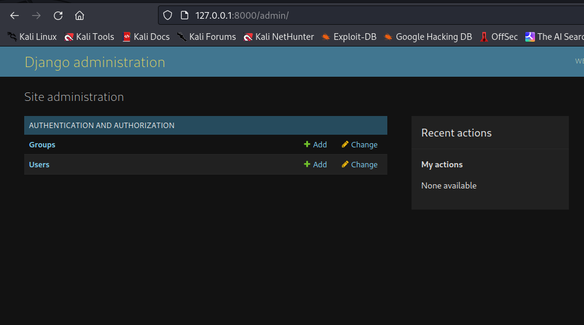
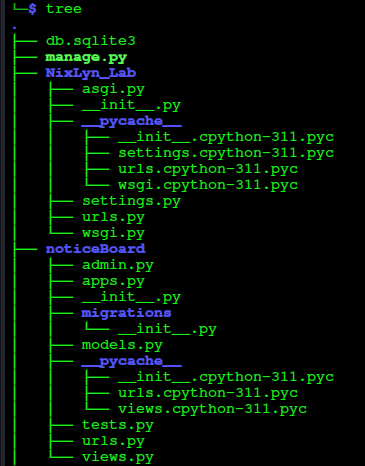
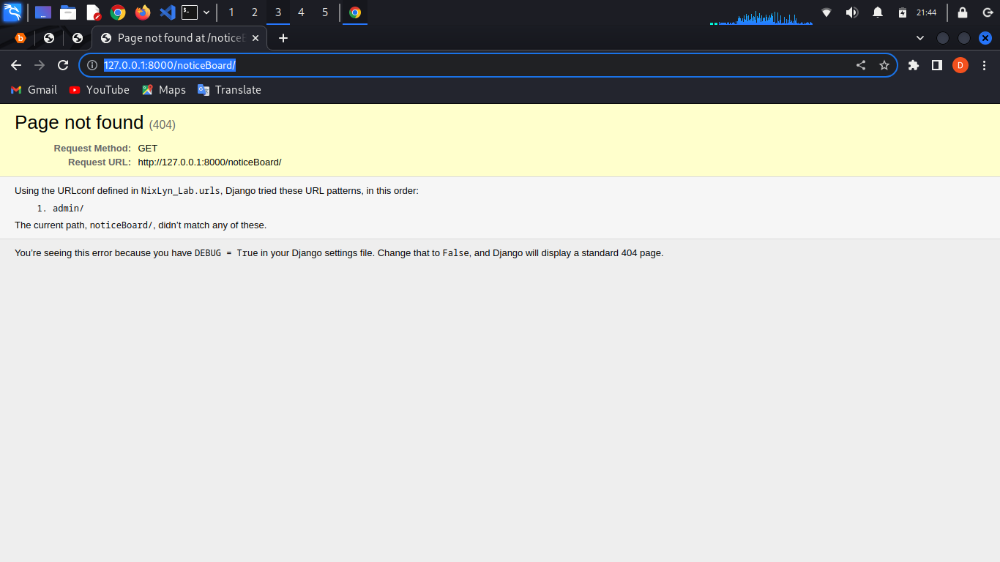
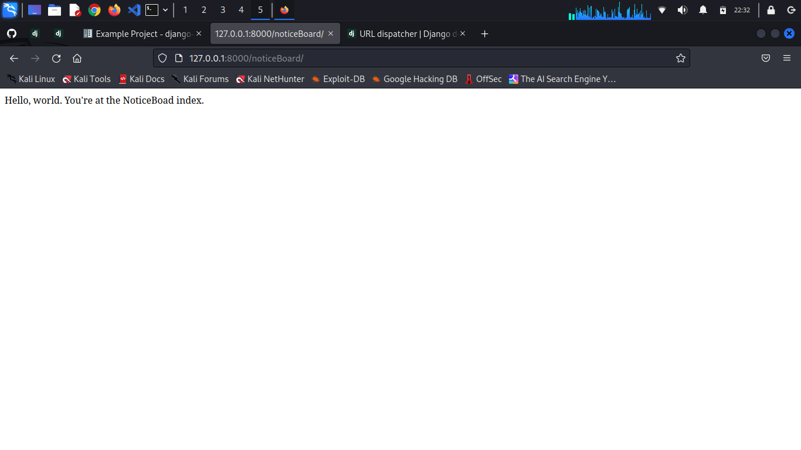

## Let's Make A SuperUser ##

```!/bin/bash
python manage.py createsuperuser
```

Enter your desired username and press enter.

```!/bin/bash
Username: admin
```

You will then be prompted for your desired email address:

```!/bin/bash
Email address: admin@example.com
```

Then Simply type in a PassWord.. twice

Then go ahead and run:

```!/bin/bash
python3 manager.py runserver
```

Make your way to the browers and go to

### 127.0.0.1:8000/admin/ ###

There you will login again, and if all goes well
you should see a page like this one:



### Next up, you can start making your first Home Page ###

First we will need to create an app:

```!/bin/bash
python manager.py startapp noticeBoard
```


You Should now see a directory tree like this:



If you are to run the server before the next steps, you should see something like:



If so, in the 'noticeBoard/views.py' file add:

```!/bin/bash
from django.http import HttpResponse

def index(request):
    return HttpResponse("Hello, world. You're at the NoticeBoad index.")
```

Then we call views in the 'noticeBoard/urls.py' file and add:

```!/bin/bash
from . import views

urlpatterns = [
    path("", views.index, name="index"),
]
```

And finally, in the 'NixLyn_Lab/ursl.py' we will change:

```!/bin/bash
urlpatterns = [
    path('admin/', admin.site.urls),
]
```

by adding:

```!/bin/bash
urlpatterns = [
    path("noticeBoard/", include("noticeBoard.urls")),
    path('admin/', admin.site.urls),
]
```

Now, run the server again:

```!/bin/bash
python manger.py runserver
```

and go on over to:

### 127.0.0.1:8000/noticeBoard/ ###

in your browers, and if all went well you will see:




