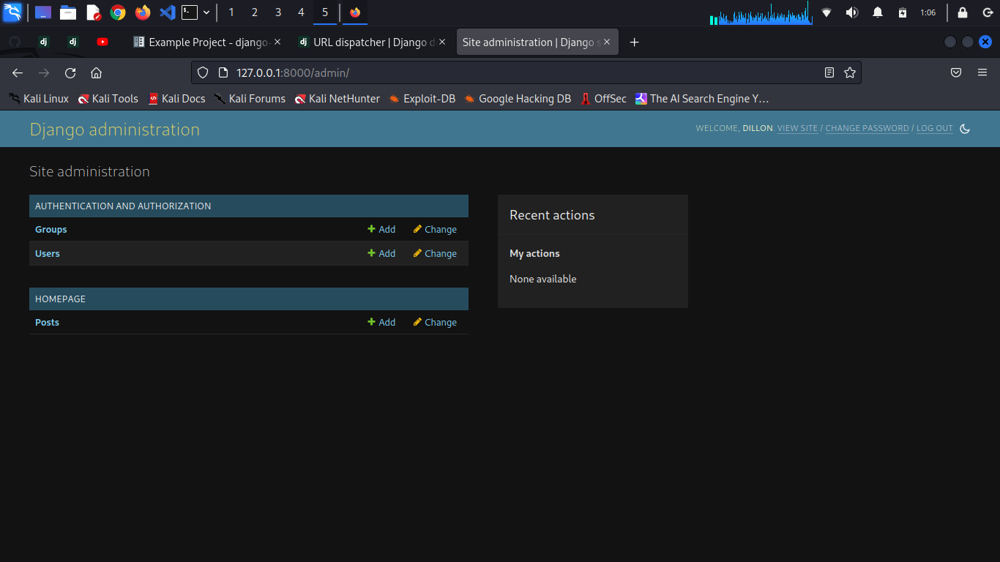
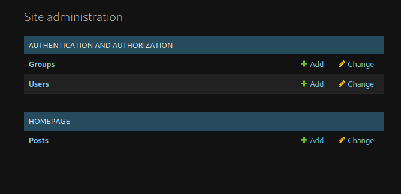
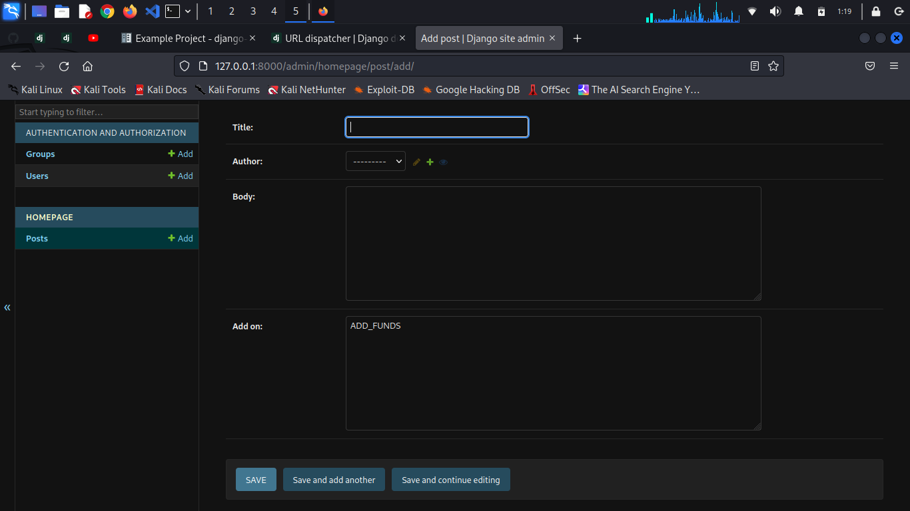
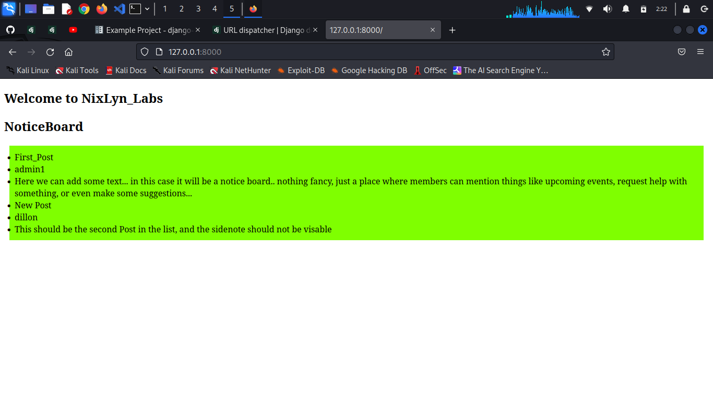
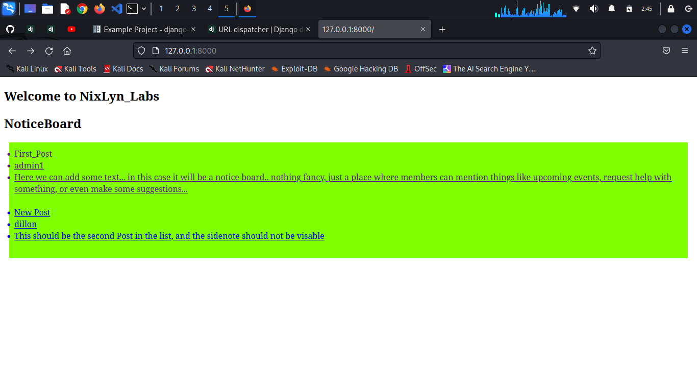
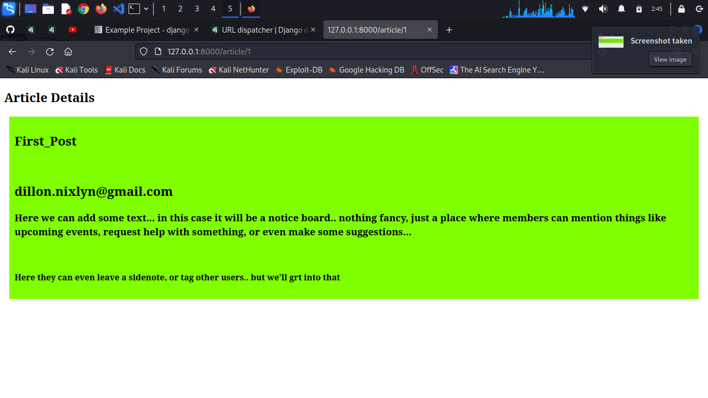

# User DataBase #

Now that we have our homepage setup, we want users to be able to
Register and Login, so let's make a database for them

This means some auth tools are in order..

in the 'homepage/models.py' file:

```!/bin/bash
from django.db import models
from django.contrib.auth.models import User
from django.urls import reverse
from datetime import datetime, date


class Post(models.Model):
    title = models.CharField(max_length=255)
    author = models.ForeignKey(User, on_delete=models.CASCADE)
    body = models.TextField()
    add_on = models.TextField(max_length=255, default="ADD_FUNDS")
    date_made  = models.DateField(auto_now_add=True)
    def __str__(self):
        return str(self.title) + " | " + str(self.author)

    def get_absolute_url(self):
        return reverse('home', )
```

Now in your 'homepage/admin.py' add :

```!/bin/bash
from django.contrib import admin
from .models import Post

admin.site.register(Post)
```

And you can now run the server and go to the '/admin' in your browers
if all goes well, you should see:



Which means that we will be able to link users to posts
but first, let's stop the server and makemigrations

```!/bin/bash
python manage.py makemigrations
```

```!/bin/bash
python manage.py migrate
```

```!/bin/bash
python manage.py runserver
```

Then head on over to the '/admin' in your browers:




You will see there is the option to add a post :)




Now back to the 'homepage/views.py' file:

ListView    : will list all the posts
DetailView  : will let us view the whole post

We are now going to use proper OOP for the views.py,
as this provides more verbose control of data

```!/bin/bash
from django.shortcuts import render
from django.views.generic import ListView, DetailView
from .models import Post

# Create your views here.
#def homepage(request):
#    return render(request, 'homepage.html', {})

class HomeView(ListView):
    model           = Post
    template_name   = 'homepage.html'

```

Now that we're moving up to class based views, we'll need to update the url methods

In 'homepage/urls.py' make these changes:

```!/bin/bash
from django.urls import path
#from . import views      <<-- Comment out
from .views import HomeView

#urlpatterns = [
#    path("", views.homepage, name="homepage"),
#]

urlpatterns = [
    path('', HomeView.as_view(), name='homepage'),
]
```


## Jinja2 ##


Now that the BackEnd is sorted, let's make the posts viewable on the home directory

### ListView ###

in the 'homapage/templates/homepage.html' file:

```!/bin/bash
<body>
    <section>
        <h1>
            Welcome to NixLyn_Labs
        </h1>
    </section>
    <section>
        <h1>NoticeBoard</h1>
        <!-- Basic Styles, just for now -->
        <ul style="background-color: chartreuse; padding: 10px 10px; margin: 10px 10px;">
            <!-- USING JINJA -->
            
                <li>{{ post.title }}</li>
                <li>{{ post.author }}</li>
                <li>{{ post.body }}</li>
            
        </ul>
    </section>
</body>
</html>
```


If you run the server and open the home page you sould see:




### DetailView ###

Now we want to be able to click on a post and open it in a new page:

So let's first add a Class in the views file for DetailViews

```!/bin/bash
class ArticleDetailView(DetailView):
    model           = Post
    template_name   = 'article_details.html'
```

And of course the urls.py

```!/bin/bash
from .views import HomeView, ArticleDetailView

urlpatterns = [
    path('', HomeView.as_view(), name='homepage'),
    path('article/<int:pk>', ArticleDetailView.as_view(), name='article-details'),
]
```

Now make a file 'homepage/temlates/article_details.html'

```!/bin/bash

<body>
    <section>
        <h1>
            Article Details
        </h1>
    </section>
    <section>
        <div style="background-color: chartreuse; padding: 10px 10px; margin: 10px 10px;">
                <h1>{{ post.title }}</h1>
                <br>
                <h2>{{ post.author.first_name }}</h2>
                <h2>{{ post.author.last_name }}</h2>
                <h2>{{ post.author.email }}</h2>
                <h3>{{ post.body }}</h3>
                <br>
                <h4>{{ post.add_on }}</h4>
        </div>
    </section>
</body>
</html>

```

You should now see that the homepage posts are clickable:




And it redirects you to..




