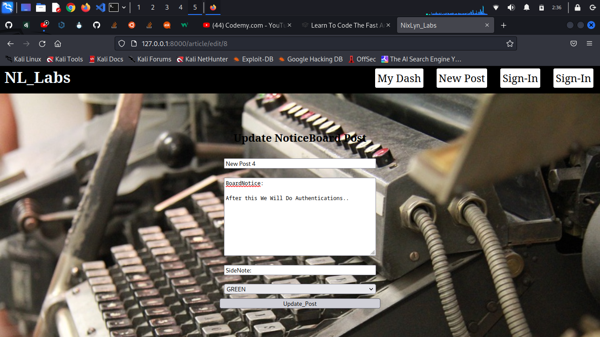
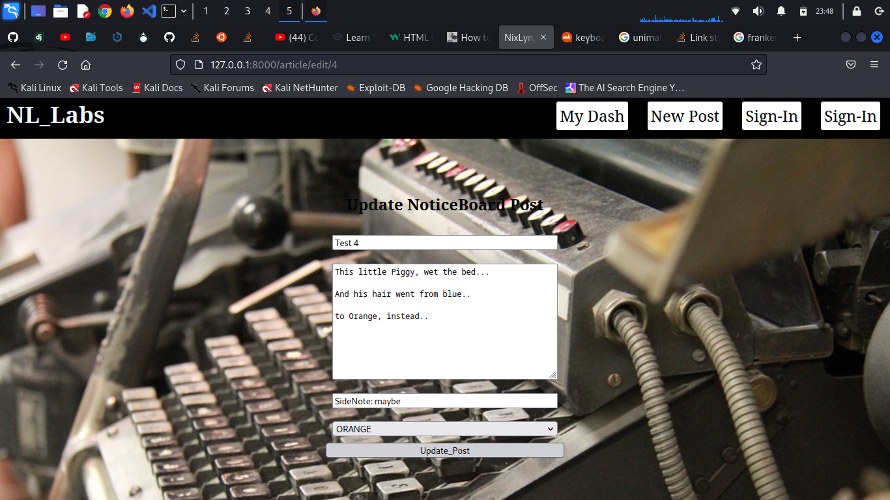
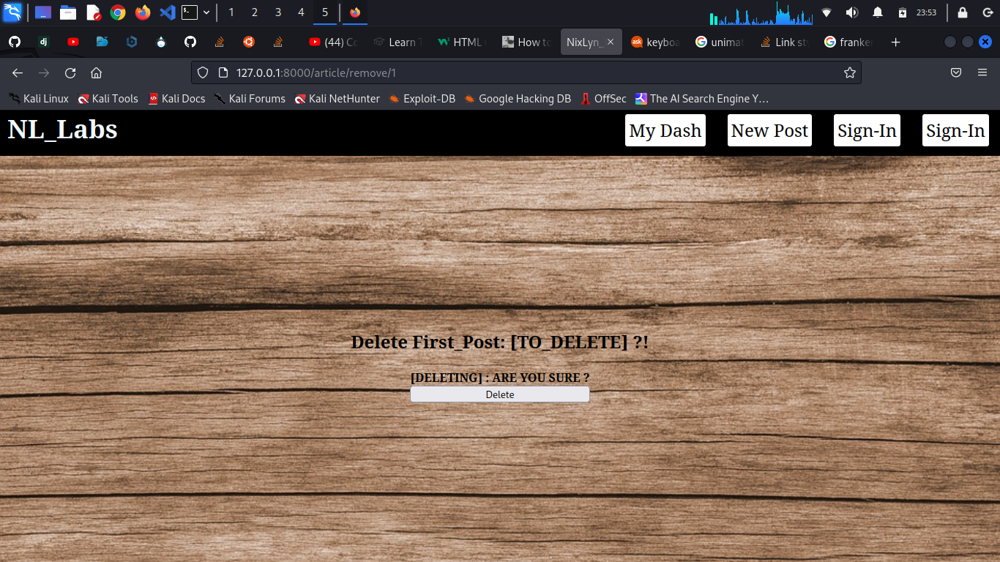

# Posts Control #

Now that we can view a list of our noticeboard posts on the homepage and view 
them in detail on a seperate page, let's make it possible for our users to add a post.

## Create New Posts ##

Here, is a screenshot before editing anything:




create a 'forms.py' in the 'homepage' folder:

```
from django import forms
from .models import Post


class PostForm(forms.ModelForm):
    class Meta:
        model = Post
        fields = ('title',  'author', 'body')
        widgets = {
            'title': forms.TextInput(attrs={'class': 'form-control'}),
            'author': forms.Select(attrs={'class': 'form-control'}),
            'body': forms.Textarea(attrs={'class': 'form-control'}),
            'add_on': forms.TextInput(attrs={'class': 'form-control'}),
        }
```

In 'homepage/models.py' add:

```
from django.urls import reverse

# Create your models here.
class Post(models.Model):
    ...

    def get_absolute_url(self):
        return reverse('article-details', args=(str(self.id)))
        # Or simply use 
        return reverse('homepage')

```

In 'homepage/views.py' add:

```
from django.views.generic import ListView, DetailView, CreateView


class AddPostView(CreateView):
    model           = Post
    template_name   = 'add_post.html'
    fields          = '__all__'

```

In the 'homepage/urls.py' add:

```
from django.urls import path
from .views import HomeView, ArticleDetailView, AddPostView

urlpatterns = [
    path('', HomeView.as_view(), name='homepage'),
    path('article/<int:pk>', ArticleDetailView.as_view(), name='article-details'),
    path('add_post/', AddPostView.as_view(), name='add_post')
]
```


Then from here, off to bootstrap for some easy form styling...

For adding a post on the FrontEnd:

You will need to add a link in the 'homepage.html' file,
within the forloop which determines the post 'Primary_Key',
the link will look like this:

```

```

and used like this:

```
            <ul class="post_head">
                
                <div class="post_block">
                    <a href="">
                        <li>{{ post.title }}</li>
                        <li>{{ post.author }}</li>
                        <li>{{ post.body }}</li>
                        <li>{{ post.color }}</li>
                        <br>
                    </a>
                </div>
                <br>
                
```

In 'add_post.html' add:

```

Add Post



    <!-- Be sure to add your .css links -->
    <section class="all_back">
        <h1>
            Add NoticeBoard Post
        </h1>
        <div class="form-group">

            <form method="POST">
                
                <div class="form_title">    {{ form.title }}    </div>
                <div class="form_author">   {{ form.author }}   </div>
                <div class="form_body">     {{ form.body }}     </div>
                <div class="form_sidenote"> {{ form.add_on }}   </div>
                <div class="form_color">    {{ form.color }}    </div>
                <button>Post</button>
            </form>
        </div>
    </section>


```

If you want to add a dropdown list to the model:

```
COLOR_CHOICES = (
    ('green','GREEN'),
    ('blue', 'BLUE'),
    ('red','RED'),
    ('orange','ORANGE'),
    ('black','BLACK'),
)

class Post(models.Model):
    ...
    color   = models.CharField(max_length=6, choices=COLOR_CHOICES, default='green'),
    ...
```
^ By default It Will Appear in the django template `{{ form.color }}` as a dropbox..
User can now add their own posts to the noticeboard,
A simular process is applied when updating a post...

! Don't Forget to:

```!/bin/bash
$ python3 manager.py makemigrations

$ python3 manager.py migrate

```
As You have now made some changes to the DataBase Structure


## Updating/Editing Post ##

Before anything, we will need to create the functions which will enable this:

The core starts at 'forms.py':
We will simply Copy+Paste the PostForm(), and make some changes...

```
class PostForm(forms.ModelForm):
    ...


class EditForm(forms.ModelForm):
    class Meta:
        model = Post
        fields = ('title', 'body', 'add_on', 'color')
        widgets = {
            'title':    forms.TextInput(attrs={'class': 'form-control'}),
            # The Author will automatically be the one removing the post
            # ! Thus Far, this is still not secure, as we will get to UserAuth in future pages
            'body':     forms.Textarea(attrs={'class': 'form-control'}),
            'add_on':   forms.TextInput(attrs={'class': 'form-control'}),
            'color':    forms.Select(attrs={'class': 'form-control'}),
        }
```

Now in the 'views.py' file:

```
from django.views.generic import ListView, DetailView, CreateView, UpdateView
from .forms import PostForm, EditForm
from django.urls import reverse_lazy

class ...

class ...

class DeletePostView(DeleteView):
    model           = Post
    template_name   = 'delete_post.html'
    fields          = '__all__'
    success_url = reverse_lazy('homepage')

```

We can now import the 'UpdatePostView()' in the 'urls.py' file,
and create the path to the template.

```
from .views import HomeView, ArticleDetailView, AddPostView, UpdatePostView

urlpatterns = [
    path(...),
    path('article/edit/<int:pk>', DeletePostView.as_view(), name='update_post'),
]

```

Finaly, we can write the FrontEnd, to access the functions:

Create 'templates/update_post.html'

```
<!-- It is not neccessary to add Author, Though thus far, anyone can still make changes -->





    <section class="all_back">
        <h1>
            Update NoticeBoard Post
        </h1>
        <div class="form-group">

            <form method="POST">
                
                <div class="form_title">    {{ form.title }}    </div>
                <div class="form_body">     {{ form.body }}     </div>
                <div class="form_sidenote"> {{ form.add_on }}   </div>
                <div class="form_color">    {{ form.color }}    </div>
                <button>Update_Post</button>
            </form>
        </div>
    </section>



```

We can now Edit/Update our Posts..




Next up, let's make it possible to delete posts

## Delete Post ##



Before anything, we will need to create the functions which will enable this:

The core starts at 'forms.py':
Much like the UpdateView, we will use the EditForm obj.

```

class EditForm(forms.ModelForm):
    class Meta:
        model = Post
        fields = ('title', 'body', 'add_on', 'color')
        widgets = {
            'title':    forms.TextInput(attrs={'class': 'form-control'}),
            'body':     forms.Textarea(attrs={'class': 'form-control'}),
            'add_on':   forms.TextInput(attrs={'class': 'form-control'}),
            'color':    forms.Select(attrs={'class': 'form-control'}),
        }
```

Now in the 'views.py' file:

```
from django.views.generic import ListView, DetailView, CreateView, UpdateView, DeleteView
from .forms import PostForm, EditForm
from django.urls import reverse_lazy

class ...

class ...

class DeletePostView(DeleteView):
    model           = Post
    template_name   = 'delete_post.html'
    fields          = '__all__'
    success_url = reverse_lazy('homepage')

```

We can now import the 'DeletePostView in the 'urls.py' file,
and create the path to the template.

```
from .views import HomeView, ArticleDetailView, AddPostView, UpdatePostView, DeletePostView 

urlpatterns = [
    path(...),
    path('article/remove/<int:pk>', DeletePostView.as_view(), name='delete_post'),
]

```

Finaly, we can write the FrontEnd, to access the functions:

Create 'templates/delete_post.html'

```

Delete Post


    <section class="all_back">
        <h1>
        <!-- It is not neccessary to add every item in the form -->
            Delete {{ post.title }} ?!
        <!-- So long as the user is aware of what they are removing -->
        </h1>
        <div class="form-group">
            <form method="POST">
                
                {{ form.as_p }}
                <!-- There are more ways to add certainty  -->
                <!-- One example, would be to use a PopUpModal to prompt 'pswd'/'ReCaptcha'/etc -->
                <!-- However, that is outside the scope of this tutorial -->
                <strong>
                    ARE YOU SURE ?!
                </strong>
                <button>Delete_Post</button>
            </form>
        </div>
    </section>


```


^ You can take my word for it, it is deleted..

### ClosingNotes ###

~ What we have here, is possible more insecure than any of my prior lovers,
more vulnerable than KingKong walking Chuck Norris, more exposed than people who 
need to pay rent, more open to attacks than that emo kid at the back of the class,
less dressed than the lady of the night...

So, let's start doing something about that...

```
...next time, on ...
```
