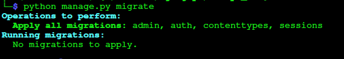
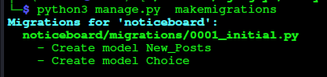

## Let's Create an SQL datbase ##

Since we have the login database already setup for /Admin
we can simply migrate the app's configs with a simple command in the base directory

```!/bin/bash
python manage.py migrate
```

It should respond with :



## NoticeBoard DataBase ##

### Creating models ###

Now we’ll define your models – essentially, your database layout, with additional metadata.
We are going to make two tables, one for posteing to the NoticeBoard, and one for adding 
Questions to that post, and even 'Votes' so that we can see how many people have the same question...

Now in our 'noticeBoard/models.py' let's add:

```!/bin/bash
from django.db import models

# New Posts For the NoticeBoard
class New_Posts(models.Model):
    new_post_title  = models.CharField(max_length=200)
    new_post_sum    = models.CharField(max_length=600)
    pub_date        = models.DateTimeField("date published")

# Responses on each New_Post
class Choice(models.Model):
    question        = models.ForeignKey(New_Posts, on_delete=models.CASCADE)
    response_text   = models.CharField(max_length=500)
    votes           = models.IntegerField(default=0)
```

In order for the rest of the django project to link this we will need to edit the
 'NixLyn_Lab/settings.py' file:

```!/bin/bash
# Application definition

INSTALLED_APPS = [
    'noticeBoard.apps.NoticeboardConfig',  <<--
    'django.contrib.admin',
    'django.contrib.auth',
    'django.contrib.contenttypes',
    'django.contrib.sessions',
    'django.contrib.messages',
    'django.contrib.staticfiles',
]
```

Now let's tell django to migrate the new tables:

```!/bin/bash
python manage.py makemigrations
```

You should see something like:



To help django make more sense of it all, let's add __str__ for it's returns

```!/bin/bash
class New_Posts(models.Model):
    new_post_title  = models.CharField(max_length=200)
    new_post_sum    = models.CharField(max_length=600)
    pub_date        = models.DateTimeField("date published")
    def __str__(self):
        return str(self.title) + " | " + str(self.author)
```

And update the migrations again

```!/bin/bash
python manage.py migrate
```

From Here we need to open the API shell (Command Line Interface)


